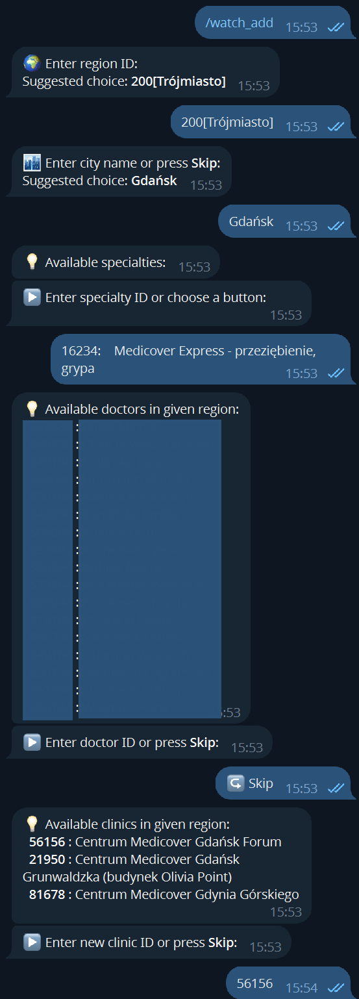
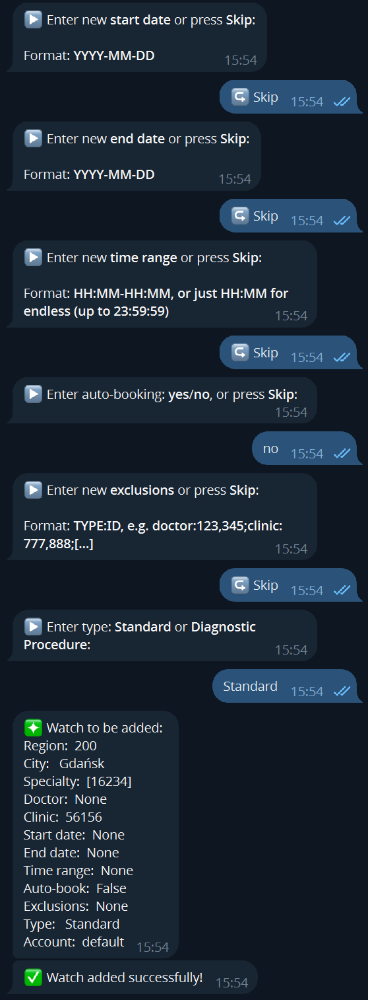
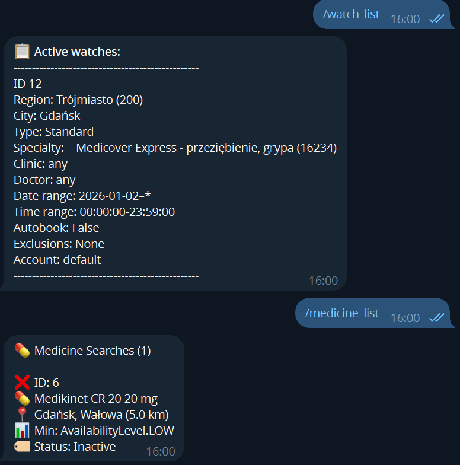
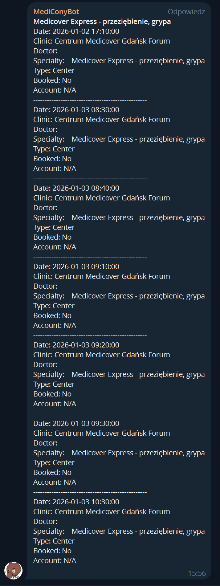
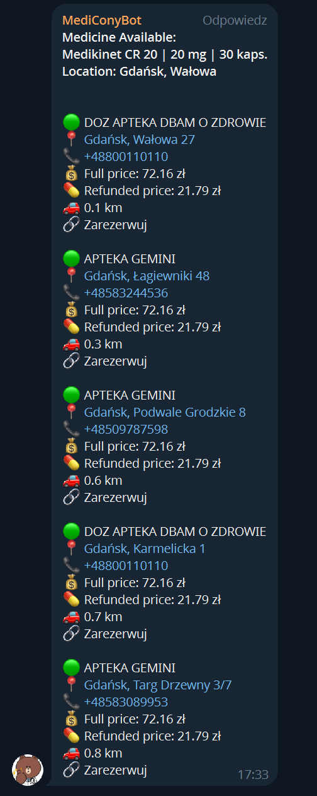
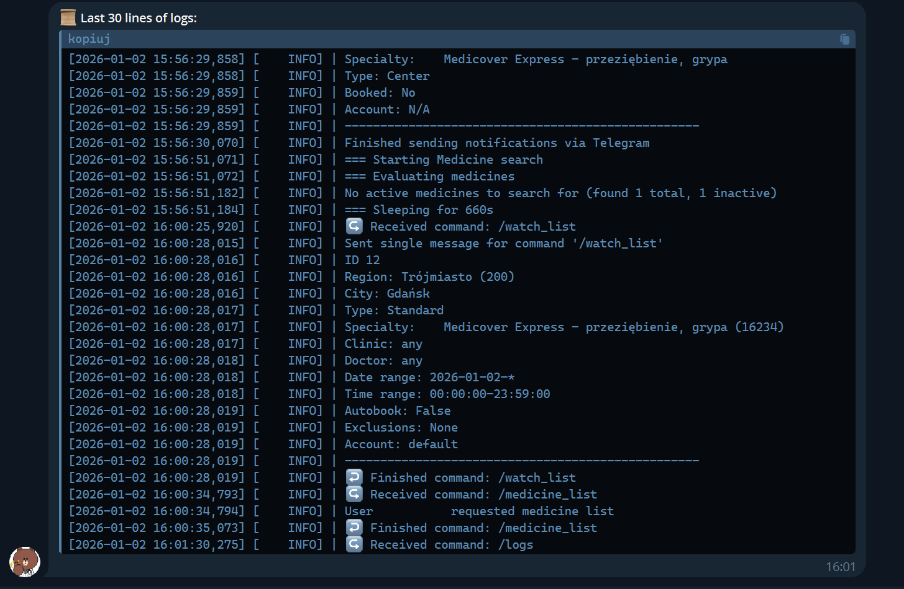

# MediCony

**Monitor your Medicover appointments and medicine availability with MediCony.** It's designed to work with the latest authentication system (as of March 2026).

- 🔍 **Automated monitoring** of appointments and examinations availability
- 💊 **Precise medicine search** for pharmacy availability with dosage and package filtering from [ktomalek.pl](https://ktomalek.pl) using [PharmaRadar](https://github.com/bartekmp/pharmaradar)
- 📅 **Automatic booking** of available appointments when found
- 💾 **PostgreSQL database** to track searches and prevent duplicate notifications
- 📱 **Telegram notifications** with interactive bot commands and reservation links
- 🐳 **Container-ready** for easy deployment and automation
- ⚡ **Multiple execution modes** - one-shot searches or continuous monitoring
- 🏗️ **Modular architecture** - separated Medicover and medicine functionality

> [!IMPORTANT]
> **Requirements**: MediCony requires a valid **Medicover account** credentials. To fully utilize the booking and appointment search features, an **active subscription** to Medicover services is highly recommended. Without a subscription, search results may be limited key features might not work as intended.
> **Multi-factor Authentication**: Fully supported. MediCony is compliant with the current Medicover login logic that demands MFA. If a 2FA code is requested during login, MediCony will immediately ask for the verification code via both its interactive Telegram bot and the terminal (CLI). Entering the code saves the device as trusted, minimizing future login interruptions.

---

## Table of Contents

- [Quick Start](#quick-start)
- [Configuration](#configuration)
- [Command Line Usage](#command-line-usage)
- [Telegram Bot](#telegram-bot)
- [Deployment](#deployment)
- [Examples](#examples)
- [Troubleshooting](#troubleshooting)

---

## Quick Start

### 1. Clone and Setup

```bash
git clone https://github.com/your-username/MediCony.git
cd MediCony/
```

### 2. Configure Environment

```bash
cp .env.example .env
# Edit .env with your credentials (see Configuration section)
```

### 3. Database Setup

MediCony uses PostgreSQL. Make sure you have:

1. **PostgreSQL server** running and accessible
2. **Database credentials** configured in your `.env` file:

```bash
POSTGRES_HOST=your_postgres_host
POSTGRES_PORT=5432
POSTGRES_USER=your_username
POSTGRES_PASSWORD=your_password
POSTGRES_DATABASE=medicony
```

### 4. Build and Run

```bash
# Build Docker image
docker build --rm -t medicony .
# or use the build script
./scripts/build_image.sh

# Run continuous monitoring
docker run -d --env-file=.env \
  -v $(pwd)/log:/app/log \
  medicony start
```

### 5. Get Help

```bash
# View all available commands
docker run --rm medicony --help

# Get help for specific command
docker run --rm medicony find-appointment --help
docker run --rm medicony add-medicine --help
```

---

## Configuration

MediCony can be configured using environment variables or a `.env` file. Environment variables take precedence over `.env` file values.

### Core Settings

| Variable             | Required | Default | Description                                              |
| -------------------- | -------- | ------- | -------------------------------------------------------- |
| `MEDICOVER_USERDATA` | ✅        | -       | Medicover credentials. Single: `username:password`. Multi: `alias1@BASE64(username):BASE64(password);alias2@...`. First alias becomes default. |
| `SLEEP_PERIOD_SEC`   | ❌        | `300`   | Interval between checks in daemon mode (seconds)         |

### Telegram Settings

| Variable                                    | Required | Default | Description                                   |
| ------------------------------------------- | -------- | ------- | --------------------------------------------- |
| `MEDICONY_TELEGRAM_CHAT_ID`                 | ❌        | -       | Your Telegram chat ID for notifications       |
| `MEDICONY_TELEGRAM_TOKEN`                   | ❌        | -       | Your Telegram bot token                       |
| `TELEGRAM_ADD_COMMAND_SUGGESTED_PROPERTIES` | ❌        | -       | Suggested values for Telegram bot add command |

### Application Settings

| Variable   | Required | Default              | Description                  |
| ---------- | -------- | -------------------- | ---------------------------- |
| `LOG_PATH` | ❌        | `log/medicony.log`   | Path to log file             |

### Database Settings

| Variable             | Required | Default     | Description                                    |
| -------------------- | -------- | ----------- | ---------------------------------------------- |
| `POSTGRES_HOST`      | ✅        | -           | PostgreSQL server host                         |
| `POSTGRES_PORT`      | ❌        | `5432`      | PostgreSQL server port                         |
| `POSTGRES_USER`      | ✅        | -           | PostgreSQL username                            |
| `POSTGRES_PASSWORD`  | ✅        | -           | PostgreSQL password                            |
| `POSTGRES_DATABASE`  | ✅        | -           | PostgreSQL database name                       |

### Example Configuration Files

#### `.env` file
```bash
# Required: Medicover account credentials (single account)
MEDICOVER_USERDATA=your_username:your_password

# Or multiple accounts (base64-encode username & password to allow any characters)
# Preferred multi-account format uses '@' between alias and encoded creds.
# Example for two accounts: main and wife
# echo -n "john.doe@example.com" | base64 -> am9obi5kb2VAZXhhbXBsZS5jb20=
# echo -n "S3cr3t:P@ss" | base64 -> UzNjcjN0OlBAc3M=
# echo -n "jane.d@example.com" | base64 -> amFuZS5kQGV4YW1wbGUuY29t
# echo -n "Sup3r$ecret" | base64 -> U3VwM3IkZWNyZXQ=
MEDICOVER_USERDATA=main@am9obi5kb2VAZXhhbXBsZS5jb20=:UzNjcjN0OlBAc3M=;wife@amFuZS5kQGV4YW1wbGUuY29t:U3VwM3IkZWNyZXQ=


# Optional: Telegram notifications
MEDICONY_TELEGRAM_CHAT_ID=1234567890
MEDICONY_TELEGRAM_TOKEN=1234567890:ABCdefGHIjklMNOpqrSTUvwxyz

# Optional: Application settings
SLEEP_PERIOD_SEC=300
LOG_PATH=log/medicony.log

# Optional: Telegram bot defaults
TELEGRAM_ADD_COMMAND_SUGGESTED_PROPERTIES=region:123[Your region];city:Your city
```

#### Environment Variables (Docker)
```bash
docker run -d \
  -e MEDICOVER_USERDATA="username:password" \
  -e MEDICONY_TELEGRAM_CHAT_ID="1234567890" \
  -e MEDICONY_TELEGRAM_TOKEN="1234567890:ABC..." \
  -e SLEEP_PERIOD_SEC="300" \
  -v $(pwd)/log:/app/log \
  medicony start
```

---

## Command Line Usage

### Getting Help

```bash
# General help
medicony --help

# Command-specific help
medicony find-appointment --help
medicony add-watch --help
medicony book-appointment --help
```

### Core Concepts

- **`Watch`** - A saved search configuration for continuous monitoring ([`src/medicover/watch.py`](src/medicover/watch.py))
- **`Appointment`** - Represents a medical appointment with all its properties ([`src/medicover/appointment.py`](src/medicover/appointment.py))
- **`Medicine`** - A saved search configuration for medicine availability, see [PharmaRadar](https://github.com/bartekmp/pharmaradar) for more

### Available Commands

#### 1. Finding Appointments

**Basic search:**
```bash
medicony find-appointment -r 204 -s 132 -sd "2025-01-15"
```

**Search with notifications:**
```bash
medicony find-appointment -r 204 -s 132 -sd "2025-01-15" -n -t "Pediatrician Check"
```

**Search in specific clinic:**
```bash
medicony find-appointment -r 204 -s 132 -sd "2025-01-15" -c 49284
```

**Search for examinations:**
```bash
medicony find-appointment -r 200 -s 19054 -sd "2025-01-15" -E
```

**Search for general practitioner:**
```bash
medicony find-appointment -r 200 -GP -sd "2025-01-15"
```

#### 2. Booking Appointments

```bash
medicony book-appointment \
  -r 200 -s 9 -c 21950 -d 488372 \
  -sd "2025-03-12T11:30:00" \
  -n -t "Appointment Booked"
```

#### 3. Managing Watches

**Add a basic watch:**
```bash
medicony add-watch -r 207 -s 19054 -sd "2025-01-04"
```

**Add watch with auto-booking:**
```bash
medicony add-watch \
  -r 200 -c 21950 -s 9 \
  -sd "2025-03-04" -ed "2025-03-12" \
  -tr "08:00:00-17:00:00" \
  -B
```

**Add watch with exclusions:**
```bash
medicony add-watch \
  -r 200 -s 9 -sd "2025-01-15" \
  -X "doctor:123,456;clinic:789"
```

**List active watches:**
```bash
medicony list-watches
```

**Edit existing watch:**
```bash
medicony edit-watch -i 1 -sd "2025-02-01" -B true
```

**Remove watch:**
```bash
medicony remove-watch -i 1
```

#### 4. Managing Appointments

**List booked appointments:**
```bash
medicony list-appointments
```

**Cancel appointment:**
```bash
medicony cancel-appointment -i 1
```

#### 5. Finding IDs

**List regions:**
```bash
medicony list-filters regions
```

**List specialties:**
```bash
medicony list-filters specialties
```

**List clinics for region/specialty:**
```bash
medicony list-filters clinics -r 200 -s 9
```

**List doctors for region/specialty:**
```bash
medicony list-filters doctors -r 204 -s 132
```

**List examinations:**
```bash
medicony list-filters examinations -r 200 -s 19054
```

#### 6. Managing Medicine Searches

**Add a new medicine search:**
```bash
medicony add-medicine --name "Aspirin" --dosage "500mg" --location "Warsaw" --radius 10
```

**Add medicine with specific package size:**
```bash
# Search for specific dosage and package amount
medicony add-medicine --name "Placeholderium R 1000" --dosage "50 mcg" --amount "50 tabl." --location "Kraków"
```

**Add medicine with price and availability filters:**
```bash
medicony add-medicine \
  --name "Placeholderium R 1000" --dosage "400mg" --amount "30 tabl." \
  --location "Kraków" --radius 15 \
  --max-price 25.50 --min-availability "available" \
  --notification --title "Placeholderium R 1000 Search"
```

**List medicine searches:**
```bash
medicony list-medicines
```

**Search for medicine availability:**
```bash
medicony search-medicine --id 1
```

**Remove medicine search:**
```bash
medicony remove-medicine --id 1
```

**Edit existing medicine search:**
```bash
medicony edit-medicine --id 1 --max-price 30.00 --min-availability "high"
```

**Search for specific medicine (one-time search):**
```bash
medicony search-medicine --id 1 --notification
```

#### 7. Daemon Mode

**Start continuous monitoring:**
```bash
medicony start
```

### Medicover Command Parameters Reference

| Parameter                | Short      | Description                            | Example                      |
| ------------------------ | ---------- | -------------------------------------- | ---------------------------- |
| `--region`               | `-r`       | Region ID (required for most commands) | `-r 200`                     |
| `--city`                 | `-m`       | City name filter                       | `-m "Warszawa"`              |
| `--specialty`            | `-s`       | Specialty ID or comma-separated list   | `-s 9` or `-s "9,132,19054"` |
| `--general-practitioner` | `-GP`      | Use general practitioner specialties   | `-GP`                        |
| `--clinic`               | `-c`       | Clinic ID filter                       | `-c 21950`                   |
| `--doctor`               | `-d`       | Doctor ID filter                       | `-d 488372`                  |
| `--date`/`--start-date`  | `-f`/`-sd` | Start date (YYYY-MM-DD)                | `-sd "2025-01-15"`           |
| `--end-date`             | `-ed`      | End date for watches                   | `-ed "2025-01-31"`           |
| `--time-range`           | `-tr`      | Time range filter                      | `-tr "08:00:00-17:00:00"`    |
| `--examination`          | `-E`       | Search for examinations                | `-E`                         |
| `--auto-book`            | `-B`       | Enable auto-booking (watches)          | `-B`                         |
| `--exclude`              | `-X`       | Exclude doctors/clinics                | `-X "doctor:123;clinic:456"` |
| `--notification`         | `-n`       | Send Telegram notifications            | `-n`                         |
| `--title`                | `-t`       | Custom notification title              | `-t "My Search"`             |
| `--id`                   | `-i`       | ID for edit/remove operations          | `-i 1`                       |

#### Medicine-Specific Parameters

| Parameter            | Short | Description                 | Example                     |
| -------------------- | ----- | --------------------------- | --------------------------- |
| `--name`             | `-n`  | Medicine name (required)    | `--name "Placeholderium R"` |
| `--dosage`           | `-d`  | Medicine dosage             | `--dosage "50 mcg"`         |
| `--amount`           | -     | Package size/amount         | `--amount "50 tabl."`       |
| `--location`         | `-l`  | Search location             | `--location "Warsaw"`       |
| `--radius`           | `-r`  | Search radius in kilometers | `--radius 10`               |
| `--max-price`        | `-p`  | Maximum price filter        | `--max-price 25.50`         |
| `--min-availability` | `-a`  | Minimum availability level  | `--min-availability "high"` |
| `--id`               | `-i`  | Medicine ID for operations  | `--id 1`                    |

**Supported dosage units:** mg, mcg, μg, g, %, ml, l  
**Supported amount units:** tabl. (tablets), szt. (pieces), kaps. (capsules), amp. (ampoules), ml, g  
**Availability levels:** `none`, `low`, `high`

---

## Telegram Bot

MediCony includes an interactive Telegram bot for managing watches and monitoring without CLI access.

### Setup Telegram Bot

1. **Create bot with BotFather:**
   - Message [@BotFather](https://t.me/botfather) on Telegram
   - Use `/newbot` command
   - Follow instructions to get your bot token

2. **Get your Chat ID:**
   ```bash
   # Send a message to your bot, then visit:
   https://api.telegram.org/bot<BOT_TOKEN>/getUpdates
   # Find your chat ID in the response
   ```

3. **Configure MediCony:**
   ```bash
   MEDICONY_TELEGRAM_CHAT_ID=your_chat_id
   MEDICONY_TELEGRAM_TOKEN=your_bot_token
   ```

4. **Add bot commands** (via [@BotFather](https://t.me/botfather)):
   ```
   watch_add - Add a new watch with guided setup
   watch_list - List all active watches
   watch_edit - Edit an existing watch
   watch_remove - Remove a watch
   medicine_add - Add a new medicine search
   medicine_list - List all medicine searches
   medicine_remove - Remove a medicine search
   medicine_edit - Edit a medicine search
   medicine_activate - Activate/deactivate medicine searches
   logs - View recent application logs (last 30 lines)
   ```

### Available Bot Commands

| Command              | Description                                                                             | Usage                                               |
| -------------------- | --------------------------------------------------------------------------------------- | --------------------------------------------------- |
| `/watch_add`         | **Add new watch** - Interactive wizard to create a new watch with step-by-step guidance | Send `/watch_add` and follow prompts                |
| `/watch_list`        | **List active watches** - Shows all current watches with their details and status       | Send `/watch_list`                                  |
| `/watch_edit`        | **Edit existing watch** - Modify watch parameters like dates, time ranges, auto-booking | Send `/watch_edit` and select watch to modify       |
| `/watch_remove`      | **Remove watch** - Delete a watch from monitoring                                       | Send `/watch_remove` and confirm deletion           |
| `/medicine_add`      | **Add new medicine search** - Interactive wizard to create a new medicine search        | Send `/medicine_add` and follow prompts             |
| `/medicine_list`     | **List medicine searches** - Shows all current medicine searches with their details     | Send `/medicine_list`                               |
| `/medicine_remove`   | **Remove medicine search** - Delete a medicine search                                   | Send `/medicine_remove` and confirm deletion        |
| `/medicine_edit`     | **Edit medicine search** - Modify medicine search parameters                            | Send `/medicine_edit` and select medicine to modify |
| `/medicine_activate` | **Activate/deactivate medicine searches** - Toggle medicine search monitoring on/off    | Send `/medicine_activate` and select medicine       |
| `/logs`              | **View application logs** - Get last 30 lines of MediCony logs for troubleshooting      | Send `/logs`                                        |

### Bot Features

- **Interactive keyboard navigation** - Easy selection of options
- **Input validation** - Prevents invalid data entry
- **Abort/Skip options** - Cancel operations or skip optional fields
- **Chunked responses** - Long messages split automatically
- **Suggested values** - Pre-configured defaults from `TELEGRAM_ADD_COMMAND_SUGGESTED_PROPERTIES`

### Visual Guide

#### Interactive Setup
Adding a watch via `/watch_add`:




#### Managing Items
Listing active watches or medicines:



#### Notifications and Results
Appointment found notification:



Medicine found notification:



#### System Monitoring
Viewing logs via `/logs`:



---

## Deployment

### Docker Deployment

#### Single Container
```bash
# Blocking mode (attached)
docker run -it --rm --env-file=.env \
  -v $(pwd)/log:/app/log \
  medicony start

# Daemon mode (detached)
docker run -d --name medicony --env-file=.env \
  -v $(pwd)/log:/app/log \
  medicony start
```

#### Docker Compose
Create `docker-compose.yml`:
```yaml
version: '3.8'

services:
  medicony:
    build: .
    container_name: medicony
    command: ["start"]
    env_file: .env
    volumes:
      - ./log:/app/log
    restart: unless-stopped
    deploy:
      resources:
        limits:
          memory: 1G
          cpus: '0.5'
```

Run:
```bash
docker-compose up -d
```

### Kubernetes Deployment

Use the provided deployment configuration:

```bash
# Copy and customize the example
cp medicony-deployment.yaml.example medicony-deployment.yaml

# Edit the deployment file with your values
kubectl apply -f medicony-deployment.yaml
```

### Database and Logs

MediCony uses PostgreSQL database and file logging:

- **Database**: stores watches, appointment history and medicine searches 
- **Logs**: `log/medicony.log` - application logs and monitoring info

**Important**: Always mount these directories as persistent volumes in containerized deployments.

---

## Examples

### Basic Usage Examples

#### 1. One-time Search for Pediatrician
```bash
# Search for pediatrician appointments in Warsaw starting from today
medicony find-appointment -r 204 -s 132 -sd "2025-01-15"
```

#### 2. Search with Telegram Notifications
```bash
# Search and send results via Telegram
medicony find-appointment \
  -r 204 -s 132 -sd "2025-01-15" \
  -n -t "Pediatrician - Warsaw"
```

#### 3. Search in Specific Clinic
```bash
# Search only in specific clinic
medicony find-appointment \
  -r 204 -s 132 -sd "2025-01-15" \
  -c 49284
```

### Advanced Usage Examples

#### 4. Auto-booking Watch
```bash
# Create watch that automatically books first available appointment
medicony add-watch \
  -r 200 -s 9 -c 21950 \
  -sd "2025-03-04" -ed "2025-03-12" \
  -tr "08:00:00-17:00:00" \
  -B
```

#### 5. Watch with Exclusions
```bash
# Monitor but exclude specific doctors and clinics
medicony add-watch \
  -r 200 -s 9 \
  -sd "2025-01-15" -ed "2025-01-31" \
  -X "doctor:12345,67890;clinic:11111,22222"
```

#### 6. General Practitioner Search
```bash
# Search for any general practitioner
medicony find-appointment -r 200 -GP -sd "2025-01-15"
```

#### 7. Examination Booking
```bash
# Book specific examination
medicony book-appointment \
  -r 200 -s 19054 -c 21950 -d 488372 \
  -sd "2025-03-12T11:30:00" \
  -E -n -t "MRI Examination"
```

#### 8. Medicine Search Examples

**Basic medicine search:**
```bash
medicony add-medicine --name "Placeholderium R 1000" --dosage "500mg" --location "Warsaw" --radius 10
```

**Medicine search with specific package size:**
```bash
# Only find medicines with exact package amount
medicony add-medicine --name "Placeholderium R 1000" --dosage "50 mcg" --amount "50 tabl." --location "Warsaw"

# Different package types supported
medicony add-medicine --name "Medicine Liquid" --dosage "200mg" --amount "100 ml" --location "Gdańsk"
medicony add-medicine --name "Medicine Caps" --dosage "25mg" --amount "60 kaps." --location "Poznań"
```

**Medicine search with filters:**
```bash
medicony add-medicine \
  --name "Placeholderium R 1000" --dosage "400mg" --amount "30 tabl." \
  --location "Kraków" --radius 15 \
  --max-price 25.50 --min-availability "available" \
  --notification --title "Placeholderium R 1000 Search"
```

### Medicine Package Filtering

MediCony supports precise medicine package filtering based on both dosage and package amount. This is especially useful when your prescription specifies an exact package size.

**How it works:**
- **Without `--amount`**: Finds all package sizes of the specified dosage
- **With `--amount`**: Only finds medicines with the exact package amount specified

**Real-world example:**
If your doctor prescribed "50 mcg tablets, 50 pieces", you can search specifically for 50-tablet packages:
```bash
medicony add-medicine --name "Thyroid Medicine" --dosage "50 mcg" --amount "50 tabl." --location "Warsaw"
```

This will only show results for 50-tablet packages, filtering out 30-tablet or 100-tablet alternatives.

**Package format recognition:**
- Parses combined formats: `"50 mcg | 50 tabl."` (from ktomalek.pl)
- Handles separate dosage and amount: `"250 mg"` + `"30 tabl."`
- Normalizes units: `μg` → `mcg`, comma → dot conversion
- Supports Polish medicine units used on ktomalek.pl

**Example pharmacy results with enhanced features:**
```
🔍 Found: Placeholderium R 1000 | 50 mcg | 50 tabl.

💊 Apteka Centralna
📍 ul. Marszałkowska 126/134, 00-008 Warszawa 🗺️
📞 +48 22 123 45 67 ☎️
💰 12.50 zł (Ryczałt: 3.20 zł)
📊 Availability: High 🟢
ℹ️ Lek wydawany na receptę, refundowany 50%
```

**Notification message features:**

MediCony retrieves most important data available about searched medicine and pharmacies that have it available:

- **🗺️ Pharmacy address**: Address in a form of clickable link leading to Google Maps
- **☎️ Telephone number**: One-tap dialing to connect with the pharmacy
- **💰 Detailed pricing info**: Both full price and prescription refund rates
- **📊 Availability level**: Color-coded availability indicators - green, yellow, red
- **ℹ️ Additional info**: Prescription requirements and refund status

### Key search fetures implementation details

#### 🔍 **Dynamic Price Extraction**
- **Automatic refund selection**: Dynamically interacts with dropdown menus to extract both "Ryczałt" (flat rate) and "Pełnopłatny" (full price) pricing
- **WebDriver integration**: Uses real browser interaction to handle JavaScript-based price dropdowns
- **Fallback mechanisms**: Graceful degradation when dynamic interaction fails

#### 📞 **Phone Number Extraction**
- **JavaScript pattern recognition**: Extracts phone numbers from `ofertyAptek.otworzDialogTelefon()` JavaScript functions
- **Clickable phone formatting**: Converts phone numbers to clickable `+48` format for easy dialing
- **Multiple extraction methods**: Combines static parsing with dynamic JavaScript analysis

#### 📍 **Google Maps links**
- **Clickable addresses**: Automatically converts pharmacy addresses to Google Maps links
- **URL encoding**: Proper handling of Polish characters and special symbols in addresses
- **Mobile-friendly**: Generates links that work on both desktop and mobile devices

#### 🔄 **Duplicate Detection**
- **Fuzzy matching**: Advanced algorithm that detects duplicate pharmacies even with slight name variations
- **Address normalization**: Compares addresses with different formatting styles
- **Missing data handling**: Smart comparison that works even when some pharmacy data is incomplete

#### 💊 **Precise Medicine Matching**
- **Dosage normalization**: Handles various dosage formats (mg, mcg, μg, %, ml, etc.)
- **Package amount parsing**: Accurately extracts and compares package sizes (tablets, capsules, ml, etc.)
- **Polish text processing**: Specialized handling of Polish pharmacy terminology and diacritics

#### 📊 **Additional Information Extraction**
- **Prescription requirements**: Detects if medicine requires prescription ("Lek wydawany na receptę")
- **Refund status**: Identifies refundable medicines and refund percentages
- **Stock availability**: Extracts current stock levels and availability status
- **Pharmacy details**: Additional opening hours, contact information, and special notes

#### ⚡ **Automatic Search Management**
- **Smart deactivation**: Automatically deactivates medicine searches when adequate availability is found
- **Threshold-based monitoring**: Configurable minimum availability levels (`none`, `low`, `high`)
- **Resource optimization**: Do not search for the medicine when it's not in an active state

---

## Testing

### End-to-End Feature Tests (`feature_test/`)

The `feature_test/` directory contains fully operational End-to-End (E2E) tests that verify MediCony functionality using **real user credentials** against the live Medicover system.

**What they test:**
*   **Authentication**: Verifies login process with real credentials (`test_auth.py`).
*   **Booking Flow**: Tests the full appointment search and booking capability (`test_booking.py`).
*   **Medicine Finder**: Verifies connectivity with pharmacy search providers (`test_medicine_finder.py`).

**How to launch:**
These tests require a valid configuration with real credentials.

1. **Configure Environment**: Ensure your `.env` file or environment variables contain valid `MEDICOVER_USERDATA`.
2. **Run Tests**:
   ```bash
   # Run all feature tests
   pytest feature_test/
   
   # Run specific test suite
   pytest feature_test/test_auth.py
   ```

> [!CAUTION]
> **Real Actions**: These tests perform **real actions** on your Medicover account, like booking and cancelling appointments (examination type only). While they aim to verify functionality safely, please monitor your account to ensure no unwanted reservations remain after testing appointment booking features.

---

## Troubleshooting

### Common Issues

#### Authentication Problems
```bash
# Verify credentials format
echo "MEDICOVER_USERDATA=username:password" > .env

# Test authentication
medicony list-filters regions
```

#### Telegram Bot Issues
```bash
# Test bot token
curl "https://api.telegram.org/bot<TOKEN>/getMe"

# Test chat ID
curl "https://api.telegram.org/bot<TOKEN>/sendMessage?chat_id=<CHAT_ID>&text=test"
```

#### Medicine Search Issues
```bash
# Test medicine search functionality
medicony search-medicine --id 1

# Verify medicine data
medicony list-medicines

# Check WebDriver setup (if scraping fails)
docker run --rm medicony --help

# Common medicine search problems:
# - Invalid location: Use full city names like "Warszawa", "Kraków"
# - Package format: Use Polish notation "50 tabl." not "50 tablets"
# - Dosage format: Use "mg", "mcg" not "milligrams"
```

#### WebDriver Setup (Non-Container Deployment)

If you're running MediCony outside of Docker containers, you need to install Chrome/Chromium and ChromeDriver manually:

**Ubuntu/Debian:**
```bash
# Install Chromium and ChromeDriver
sudo apt-get update
sudo apt-get install -y chromium-browser chromium-chromedriver

# Alternative: Install Google Chrome
wget -q -O - https://dl.google.com/linux/linux_signing_key.pub | sudo apt-key add -
echo "deb [arch=amd64] http://dl.google.com/linux/chrome/deb/ stable main" | sudo tee /etc/apt/sources.list.d/google-chrome.list
sudo apt-get update
sudo apt-get install -y google-chrome-stable

# Install ChromeDriver separately if needed
sudo apt-get install -y chromium-chromedriver
```

**Alpine Linux:**
```bash
# Install Chromium and ChromeDriver (same as container setup)
apk add --no-cache chromium chromium-chromedriver xvfb
```

**macOS:**
```bash
# Using Homebrew
brew install chromium chromedriver

# Or install Google Chrome manually and ChromeDriver
brew install chromedriver
```

**Verify installation:**
```bash
# Check Chrome/Chromium
chromium-browser --version
# or
google-chrome --version

# Check ChromeDriver
chromedriver --version
```

**Note:** The application is optimized for container deployment where all dependencies are pre-installed. For local development, ensure ChromeDriver is in your PATH or matches your Chrome version.

### Logging and Debugging

**View recent logs:**
```bash
# Last 50 lines
tail -n 50 log/medicony.log

# Follow logs in real-time
tail -f log/medicony.log

# Via Telegram bot
# Send /logs command to your bot
```

**Container debugging:**
```bash
# Check container status
docker ps
docker logs medicony

# Access container shell
docker exec -it medicony bash
```

### Performance Optimization

**Adjust monitoring frequency:**
```bash
# Check every 5 minutes instead of default 5 minutes
SLEEP_PERIOD_SEC=300

# More frequent (every minute) - use with caution, you may get banned
SLEEP_PERIOD_SEC=60
```

**Database maintenance:**
```bash
# Clean old data (manual cleanup)
# Database cleanup (PostgreSQL)
# Use psql to connect to your PostgreSQL database and run cleanup queries
psql -h $POSTGRES_HOST -p $POSTGRES_PORT -U $POSTGRES_USER -d $POSTGRES_DATABASE -c "DELETE FROM appointment WHERE created_at < NOW() - INTERVAL '30 days';"
```

---

## File Structure

```
MediCony/
├── src/                               # Source code
│   ├── app/                           # Application orchestration layer
│   │   ├── medicony_app.py            # Main app coordinator
│   │   ├── medicine_app.py            # Medicine workflow orchestration
│   │   └── medicover_app.py           # Medicover workflow orchestration
│   ├── bot/                           # Telegram bot functionality
│   │   ├── interactive_bot.py         # Bot runner and handlers wiring
│   │   ├── shared_utils.py            # Shared bot helper functions
│   │   ├── telegram.py                # Telegram client integration
│   │   ├── validation_utils.py        # Bot input validation
│   │   └── commands/                  # Individual bot commands
│   │       ├── logs.py                # Show recent logs
│   │       ├── medicine_*.py          # Medicine commands
│   │       ├── search_now.py          # Trigger immediate search (watch & medicine)
│   │       └── watch_*.py             # Watch commands
│   ├── database/                      # Database clients and persistence
│   │   ├── base_db.py                 # Shared DB setup utilities
│   │   ├── medicover_client.py        # Medicover DB facade
│   │   ├── medicover_db.py            # Medicover tables operations
│   │   ├── pharma_client.py           # Pharmacy DB facade
│   │   └── pharma_db.py               # Pharmacy tables operations
│   ├── medicover/                     # Medicover domain logic
│   │   ├── api_client.py              # Medicover API wrapper
│   │   ├── appointment.py             # Appointment entities
│   │   ├── auth.py                    # Login and token flow
│   │   ├── matchers.py                # Appointment filtering logic
│   │   ├── presenters.py              # User-facing formatting helpers
│   │   ├── watch.py                   # Watch entities and helpers
│   │   └── services/                  # Domain services
│   │       └── watch_service.py       # Watch service layer
│   ├── config.py                      # Environment configuration parsing
│   ├── http_client.py                 # Authenticated HTTP client utilities
│   ├── id_value_util.py               # ID/name conversion helpers
│   ├── logger.py                      # Logging setup and helpers
│   ├── models.py                      # SQLAlchemy ORM models
│   └── parse_args.py                  # CLI argument definitions
├── tests/                             # Unit tests
│   ├── medicover/                     # Medicover-focused tests
│   ├── conftest.py                    # Shared pytest fixtures
│   └── test_*.py                      # General unit test modules
├── feature_test/                      # End-to-end integration tests
│   ├── conftest.py                    # Shared E2E fixtures
│   └── test_*.py                      # Live-flow E2E tests
├── scripts/                           # Helper scripts
│   ├── build_image.sh                 # Build container image
│   ├── debug.sh                       # Run in debug mode
│   ├── execute.sh                     # Generic script entry wrapper
│   ├── health_check.sh                # Runtime health check
│   ├── quick_check.sh                 # Fast local smoke check
│   └── start.sh                       # Start app/monitoring mode
├── docs/                              # Screenshots
├── example_filters/                   # Example filter files
├── log/                               # Application logs
├── .env.example                       # Environment template
├── Dockerfile                         # Container definition
├── medicony-deployment.yaml.example   # Kubernetes deployment template example
├── pyproject.toml                     # Python project configuration
├── renovate.json                      # Renovate configuration
└── medicony.py                        # CLI entry point
```

---

## License

See [LICENSE](LICENSE) file for details.
